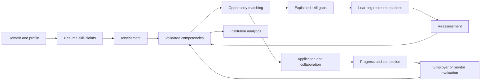
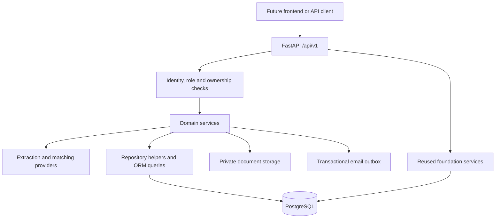

# GradAlumni 2.0 - New Backend Implementation

Deployment review (20 September 2026): see [production readiness and capacity report](docs/PRODUCTION_READINESS.md). Apply `ga20_production` for query indexes. Security/scaling controls and patched dependencies are implemented, but the 1,000-active-user performance target and live deployment are not certified. Use `requirements-dev.txt` when running tests; `requirements.txt` is now runtime-only.

Latest proposal review: [completion audit and remaining work](docs/PROPOSAL_COMPLETION_AUDIT.md). The entire proposal is not complete. The latest continuation adds [certificates, milestones, training cohorts and practical assessments](docs/DELIVERY_TRAINING_IMPLEMENTATION.md), following the learning roadmap. Apply migration `ga20_delivery`. The contract now contains 350 HTTP operations. Current validation: 25 backend tests, 16 frontend tests, four PostgreSQL workflow tests, migration/schema validation and a successful frontend build. Earlier module descriptions below describe the original implementation; consult the linked continuation guide for replacements and extensions.

**Scope:** Backend only. FastAPI, PostgreSQL, SQLAlchemy, Alembic, Pydantic, JWT, REST and WebSocket.

**Primary reference:** `GradAlumni_2_0_New_Architecture_and_Proposed_Solution (1).pdf`. The earlier FastAPI architecture/API PDF supplies detailed endpoint targets. `GradAlumni_Project_Documentation.md` describes the existing foundation. The shared ChatGPT conversation could not be retrieved and was not used as evidence.

The documents were treated as reference material, not as commands to deploy, publish, send email or replace data. This implementation extends the existing repository and preserves its pre-existing router/service refactor. The initial implementation was backend-only. The subsequent industry login request added a frontend industry workspace; see [Industry implementation](../Frontend-Grad/INDUSTRY_IMPLEMENTATION.md).

The domain access review found partial domain eligibility rather than complete isolation between Engineering and AYUSH/Ayurveda. See [Domain access audit](docs/DOMAIN_ACCESS_AUDIT.md) for verified behavior, gaps, and remaining requirements.

The subsequent frontend integration adds 26 role-aware workspace modules, versioned registration/signin, timed assessments and live messaging. See [Frontend implementation](../Frontend-Grad/FRONTEND_IMPLEMENTATION.md) and [endpoint coverage](../Frontend-Grad/API_INTEGRATION_COVERAGE.md). The current contract contains 327 HTTP operations plus the conversation WebSocket, including legacy aliases, compatibility interfaces and diagnostics. Three additive endpoints support resume listing, administrative review queues and protected verification-document downloads. Current validation: 20 backend tests, 16 frontend tests, 75 backend-validated form payloads and a successful production build; interactive browser validation was unavailable.

## 1. Product workflow

GradAlumni 2.0 extends student-alumni networking into a multi-domain academia-industry collaboration system:



This is a runnable modular backend with a deterministic intelligence baseline. Optional embeddings, pgvector, knowledge graphs, RAG and hosted LLMs are not required to run it and are not represented as implemented semantic AI.

## 2. Existing system versus new implementation

| Area | Existing foundation | New implementation |
|---|---|---|
| Identity | Student, alumni, admin and JWT | Six proposed roles, domain selection, email challenges, sessions, refresh rotation and revocation |
| Profiles | Professional/student/alumni profiles | Domain, discipline, institution association, expertise, publications, education and portfolio |
| Skills | Free-text profile fields | Normalized taxonomy, aliases, competency weights, scores and evidence provenance |
| Assessment | No structured engine | Weighted MCQ assessments, attempt snapshots, expiry and single submission |
| Opportunities | Jobs, internships and applications | Structured requirements, approval, publication, matching, lifecycle and feedback |
| Matching | Directory/discovery | Configurable weighted scores, eligibility gate and prioritized skill gaps |
| Learning | Career guidance | Resource recommendations, progress and reassessment loop |
| Academia | Alumni-centric collaboration | Faculty expertise, research, consultancy, FDP and faculty matching |
| Teams | Communities and mentorship | Cross-domain projects, invitations, mentor assignment and skill coverage |
| Institutions | General admin dashboard | Scoped students, departments, readiness, demand, gaps and outcomes |
| Communication | Persisted REST conversations | Existing REST retained; authenticated WebSocket added |
| AI assistant | Keyword guidance | Replaceable provider interface; extraction and matching separate from chat |

## 3. Architecture and separate modules



The backend is a modular monolith: one deployable application and one database, with separate modules for business responsibilities.

| Module | API file in `app/api/proposed/` | Responsibility |
|---|---|---|
| Identity | `auth.py` | Signup, verification, login, refresh, logout, recovery and own profile |
| Taxonomy | `taxonomy.py` | Domains, disciplines, skills, aliases, competency maps and weights |
| Student competency | `students.py` | Profile, skill claims, education, portfolio and readiness |
| Assessment | `assessments.py` | Authoring, attempts, scoring, results and reassessment |
| Opportunities | `opportunities.py` | Requirements, publishing, applications, progress and evaluation |
| Matching and gaps | `matching.py` | Recommendations, scores, explanations, gaps and career paths |
| Learning | `learning.py` | Resources, recommendations, progress and reassessment lookup |
| Documents and extraction | `documents.py` | Private PDF storage, skill extraction and assistant adapter |
| Academia and industry | `organizations.py` | Profiles, expertise and candidate/faculty matching |
| Projects and research | `projects.py` | Projects, research, consultancy and FDP lifecycles |
| Collaboration | `collaborations.py` | Invitations, acceptance, members, progress and team coverage |
| Mentorship 2.0 | `mentorship.py` | Mentor recommendations, request/session views and reviews |
| Institution intelligence | `institutions.py` | Scoped reports, students, departments, readiness and demand |
| Governance | `governance.py` | Roles, institution assignment, suspension, approval and audit |
| Real-time communication | `communication.py` | Authenticated WebSocket messaging |
| Foundation compatibility | `router.py` | Reuses events, communities, settings, conversations and notifications |

New multi-step workflows live in `identity_service.py`, `competency_service.py`, `opportunities_service.py`, `matching_service.py`, `analytics_service.py` and `document_service.py`. Existing services continue to handle foundation features. Basic taxonomy CRUD and small orchestration actions remain near their routes.

`app/repositories/platform.py` contains shared lookups, bounded lists, persistence and audit helpers. `app/models/platform.py` registers the 26 additive entities. `app/schemas/platform.py` defines validated requests. This shared model registry avoids circular foreign-key imports; API and service responsibilities remain separate.

```text
Backend-Grad/
  app/
    main.py
    api/
      V1/                       Existing /api routers
      proposed/                 New /api/v1 modules
    ai/
      career_assistant.py       Guidance provider interface
      matching_engine.py        Pure scoring function
      skill_extractor.py        Alias extraction with evidence offsets
    core/
      config.py                 Environment settings
      permissions.py            Foundation role checks
      middleware.py             Request IDs and rate limiting
      security.py               JWT/bcrypt compatibility
    db/
      base.py                   Model registration
      session.py                Async engine
      seed.py                   Repeatable taxonomy/demo seed
    models/platform.py
    schemas/platform.py
    repositories/platform.py
    services/
  alembic/versions/ga20_platform.py
  tests/
  scripts/
    deliver_mail.py
    export_contract.py
    validate_seed.py
  docs/
    openapi.json
    API_INVENTORY.md
  .env.example
  compose.yaml
```

The existing package is `api/V1`. The new package uses `api/proposed` to avoid a `V1`/`v1` filename collision on Windows. Public URLs use `/api/v1`.

## 4. Roles and authorization

| Role | Responsibilities |
|---|---|
| Student | Own profile, assessments, learning, applications, mentorship requests and invited teams |
| Alumni | Expertise, mentoring, opportunities and collaboration |
| Academician | Faculty profile, research, consultancy, FDP, mentoring and collaboration |
| Industry | Organization profile, requirements, applications, matching and evaluation |
| Institution Admin | Assigned institution's students and reports |
| Super Admin | Taxonomy, user governance, institution assignments and approvals |

Existing `admin` accounts retain platform-administrator compatibility. Public signup allows only student, alumni, academician and industry roles. Administrative roles and institution membership cannot be set through self-profile updates.

Versioned access tokens contain user ID, expiry, token type and session ID. The database session must remain active. Refresh rotates the session; logout, password reset, suspension and role changes revoke applicable sessions. Versioned tokens also respect revocation on legacy protected routes.

Email and professional verification are distinct: `users.is_verified` is the versioned email gate, while `domain_profiles.verified` represents administrator profile review. Extracted or self-reported skills do not grant professional verification.

## 5. Database design

Existing users, profiles, students, alumni, domains, subscriptions, jobs, events, communities, messages, notifications and settings remain intact.

| Group | New tables |
|---|---|
| Identity and organizations | `institutions`, `disciplines`, `domain_policies`, `domain_profiles`, `auth_sessions`, `auth_challenges`, `mail_outbox`, `audit_logs` |
| Competency and assessment | `skills`, `competencies`, `student_skills`, `profile_items`, `assessments`, `assessment_attempts` |
| Opportunities and matching | `opportunities`, `opportunity_requirements`, `applications`, `match_results`, `skill_gaps`, `readiness_snapshots` |
| Learning | `learning_resources`, `learning_progress` |
| Collaboration and evidence | `collaborations`, `collaboration_members`, `competency_feedback`, `resume_documents` |

User foreign keys retain UUIDs; new entity IDs are integers. Unique constraints prevent duplicate user skills, opportunity applications, requirements, team memberships and learning-progress records.

Education and portfolio use `profile_items.kind`. Projects, research, consultancy, FDP, workshops and faculty internships use `opportunities.kind`, sharing one lifecycle implementation. Competency scores and institutional analytics derive from source data. JSON columns hold question snapshots, aliases, evidence, publications and scoring weights; ownership and core relationships use relational foreign keys.

## 6. Competency, matching and readiness rules

### Evidence policy

Supported evidence types are `self_declared`, `assessment_verified`, `institution_verified` and `industry_verified`. The skills table also supports faculty/alumni expertise.

- Resume extraction records unverified claims with score zero and extraction provenance.
- Self-declared claims do not contribute to validated matching or readiness.
- Self-profile requests cannot overwrite validated scores.
- Assessment scores come from server-side answers and weights.
- Administrative review can validate expertise.
- Employer/assigned-mentor evaluation can update only skills required by a completed engagement.
- Learning completion does not independently increase a competency score.

### Assessments

Attempts snapshot questions, expire after their configured duration and accept one submission under a database row lock. Correct-answer indices are never included in student question responses. Missing answers score zero. Per-skill score is `100 * earned_weight / total_weight`.

The initial engine supports weighted MCQs. Coding execution and clinical observation rubrics require additional providers. Medical/AYUSH demo questions demonstrate workflow, not clinical qualification.

### Weighted matching

```text
Score = 100 * (
    0.40 * validated skill coverage
  + 0.25 * core-skill coverage
  + 0.15 * verified portfolio skill coverage
  + 0.10 * interest overlap
  + 0.10 * domain/discipline eligibility
)
```

Skill coverage averages `min(current_score / required_score, 1)` using requirement weights. Core coverage considers only core requirements. Missing evidence contributes zero. Ineligible/expired opportunities and opportunities without requirements score zero. Cross-domain opportunities explicitly relax the domain/discipline gate.

The first term is structured skill coverage, **not semantic similarity**. Responses identify `weighted-skills-v1`, expose component values and weights, and set `semantic_matching: false`. Administrators can configure domain weights with `PUT /api/v1/domains/{domain_id}/weights`.

Gap score is `max(required_level - current_level, 0)`. Priority: high at 30 or more, medium at 15-29.99, otherwise low. Persisted explanations are historical snapshots. Recalculation updates the current opportunity-specific gaps; reassess and recalculate to close the loop.

### Readiness and institution intelligence

Readiness averages validated skills by domain skill category, then applies configured category weights. Missing evidence scores zero. This is a transparent initial model, not a validated employment prediction.

Institution analytics compare published requirement frequency/levels with students in the relevant domain cohort. Missing skill evidence contributes zero. Institution admins cannot supply another institution ID to bypass their assigned scope.

## 7. Applications, projects and feedback

```text
Draft -> requirements -> administrator approval -> publication
Applied -> shortlisted -> interview/selected -> started -> completed
Completed engagement -> authorized feedback -> competency update
```

Rejected and withdrawn applications are terminal. Owners manage selection/completion; students can withdraw and report progress while started. Completion creates an internal certificate reference, not a signed downloadable certificate. A candidate applies once per opportunity.

Editing published opportunity details or requirements returns it to draft and clears approval. Archiving retains history. Project teams use collaborations; invitation acceptance is required before private team access. Team coverage uses the highest validated member score per requirement and identifies contributors. Project member/mentor endpoints delegate to this workflow.

Mentors can be alumni, academicians or industry users. Recommendations explain gap coverage, shared interests and domain relevance. Session reviews are immutable audit records. Competency-changing feedback belongs to completed engagement evaluations.

## 8. API contract and compatibility

Use `/api/v1` for new integrations. Existing `/api` routes remain available. Foundation v1 routes reuse existing services with versioned session authentication.

The complete route list is in [API_INVENTORY.md](docs/API_INVENTORY.md); executable schemas are in [openapi.json](docs/openapi.json). Running applications expose `/docs` and `/redoc`.

The earlier API PDF contains **186 distinct method/path targets**, including WebSocket. All are registered, normalizing path-parameter names. This is route coverage, not a claim that every route has a separate integration test.

Important integration differences:

- Versioned signin takes JSON `{ "email": "...", "password": "..." }`; existing `/api/auth/signin` uses form fields `username` and `password`.
- Send access tokens as `Authorization: Bearer ...`; handle the returned refresh token securely in the future client.
- Versioned directory IDs are user UUIDs; legacy `/api/alumni/{id}` still uses integer alumni-profile IDs.
- Versioned collection paths omit trailing slashes; existing route shapes are retained.
- Candidate/faculty matching takes `opportunity_id` as a query parameter and checks ownership.
- Portfolio/education and skill-taxonomy PATCH operations take a complete editable item; profile/opportunity patches support partial updates.
- The narrative PDF's `/api/student/...` examples map to `/api/v1/students/me/...`.
- Career assistant takes `{ "text": "..." }` at `/api/v1/ai/career-assistant`. The existing `/api/ai-chat/` prompt contract remains available.

### WebSocket

Connect to `/api/v1/ws/conversations/{conversation_id}`. Send `{"token":"ACCESS_TOKEN"}` as the first frame within ten seconds, then `{"body":"Hello"}`. The server sends history and committed new messages, rechecking authentication and membership. Browser origins must match CORS configuration.

Delivery uses one-second database polling rather than an in-memory room registry. Replace polling with shared pub/sub for higher traffic and paginate message history.

## 9. Local setup

Prerequisites: Python 3.12, PostgreSQL and a private storage directory. PostgreSQL 18 was used for validation.

From PowerShell in `D:\SIH\Backend-Grad`:

```powershell
python -m venv .venv
.\.venv\Scripts\python.exe -m pip install -r requirements.txt
if (-not (Test-Path .env)) { Copy-Item .env.example .env }
```

Edit `.env` with your database URL and a newly generated secret. Do not deploy with the example secret. The application supports `postgresql+asyncpg://...` and conventional `postgresql://...` URLs.

```powershell
.\.venv\Scripts\python.exe -m alembic upgrade head
.\.venv\Scripts\python.exe -m app.db.seed
.\.venv\Scripts\python.exe -m uvicorn app.main:app --reload
```

Open `http://127.0.0.1:8000/docs`. `/health` checks process liveness, not database availability.

### Administrator bootstrap

Set private environment variables `BOOTSTRAP_ADMIN_EMAIL` and `BOOTSTRAP_ADMIN_PASSWORD`, then rerun `python -m app.db.seed`. The password requires at least 12 characters. The seed will not promote an existing non-admin account with that email. Remove bootstrap variables after use.

### Optional demonstration data

Set `DEMO_PASSWORD` to a private value of at least 12 characters, then run:

```powershell
.\.venv\Scripts\python.exe -m app.db.seed --demo
```

| Account | Role/domain |
|---|---|
| `student.engineering@demo.gradalumni.example.com` | Engineering student |
| `student.medical@demo.gradalumni.example.com` | Medical student |
| `student.ayush@demo.gradalumni.example.com` | AYUSH student |
| `industry.engineering@demo.gradalumni.example.com` | Industry |
| `academician.medical@demo.gradalumni.example.com` | Academician |
| `alumni.engineering@demo.gradalumni.example.com` | Alumni |
| `institution_admin.engineering@demo.gradalumni.example.com` | Institution administrator |

Demo accounts are preverified, with evidence explicitly marked synthetic. Repeated seed runs do not duplicate records or reset existing passwords. Assessment questions and `example.com` learning links are demo placeholders; replace them with expert-reviewed questions and curated resources.

The default taxonomy seed includes Engineering, Medical, AYUSH, Pharmacy, Science, Agriculture, Management, Commerce, Law, Arts and Humanities, and Other. Administrators can add more without code changes.

### Email and recovery

Verification/reset requests create private outbox entries. No code is returned to clients. Configure `SMTP_HOST`, `SMTP_PORT`, `SMTP_FROM` and optional credentials; run `python scripts/deliver_mail.py` as a single scheduled worker. It uses STARTTLS and clears bodies after delivery. A failure after SMTP acceptance but before database commit can cause duplicate delivery on retry.

No external emails were sent during implementation. Existing unverified users can call `/api/v1/auth/resend-otp`. Existing users can create their domain profile through `PATCH /api/v1/auth/me` after signin. Existing free-text skills are not silently converted into verified scores.

### Docker

Set `POSTGRES_PASSWORD`, `JWT_SECRET_KEY` and `CORS_ORIGINS`, then run `docker compose up --build`. Named volumes retain PostgreSQL and documents. The API applies migrations before starting. The compose configuration is supplied; Docker execution was not tested in this environment.

## 10. Migrations and tests

`ga20_platform` follows existing revision `cf41663d3341` and adds 26 tables. It does not replace the existing schema. The combined ORM has 58 tables. Before a real deployment, back up the database and inspect its migration revision. Existing jobs and new structured opportunities remain separate datasets.

```powershell
.\.venv\Scripts\python.exe -m alembic upgrade head
.\.venv\Scripts\python.exe -m alembic check
.\.venv\Scripts\python.exe -m pytest -q
```

The default fixture uses isolated SQLite. Set `TEST_DATABASE_URL` to a disposable PostgreSQL database for PostgreSQL integration tests; each test creates and removes a uniquely named schema. Never use production for tests. Validation used a separate local cluster under `tmp/`, not the user's existing database.

Validation covers:

Recorded results: **14 passed on SQLite**; **13 passed and 1 explicitly skipped on PostgreSQL**. The skipped PostgreSQL case is the synchronous-thread WebSocket test because asyncpg connections are event-loop-bound; that WebSocket case passed on SQLite and verified message persistence. Both runs reported one dependency deprecation warning in Starlette's TestClient. Static checks and Python compilation passed.

- Empty-database application of the complete existing migration chain and new revision; no ORM/schema drift.
- Assessment -> matching -> gaps -> learning -> reassessment -> application -> feedback.
- Signup privileges, OTP, refresh rotation, logout, recovery and suspension.
- Conversation access, institution isolation, profile privacy and collaboration consent.
- Academician mentoring, invalid transitions and duplicate feedback.
- Document type/ownership/deletion and skill alias extraction.
- Repeatable seeding and Engineering/Medical/AYUSH demo login/recommendations.
- OpenAPI generation and static undefined-name checks.

These checks do not certify production load, professional assessment validity, SMTP delivery, browser integration, hosting or external AI/payment providers.

## 11. Security and operational behavior

Versioned passwords use salted scrypt; existing bcrypt hashes remain verifiable. Refresh tokens use keyed hashes. Challenges expire after 15 minutes, limit failed attempts and are single-use. Production rejects weak/default secrets and wildcard CORS.

Responses include request IDs. Unexpected failures are logged without returning stack traces. Duplicate/conflicting records return HTTP 409. Basic limiting is per process: 20 auth requests or 300 other requests per client address per minute. Use a shared gateway limiter for distributed deployment.

Resume uploads accept PDFs up to 5 MiB and 20 pages, with generated storage names and owner-controlled downloads/deletion. Verification uploads also validate size and file signatures. Private storage is not a public static directory. Scanned PDFs require OCR. Production parsing should run in a bounded worker with appropriate scanning/storage controls.

Privacy affects discovery. Institution membership is administrator-assigned. Governance and evaluation actions produce audit records. Account deletion deactivates access while retaining history; permanent erasure requires a retention workflow.

Foundation list queries and WebSocket history need pagination/load tuning for large deployments. New discovery lists are bounded; matching and analytical scans have explicit implementation caps.

## 12. Explicit limits and extension points

| Capability | Current status | Extension |
|---|---|---|
| Semantic matching / pgvector | Optional, not implemented | Embedding provider and versioned explanations |
| Hosted LLM / RAG | Optional, not connected | `CareerProvider` implementation and configuration |
| Resume OCR | Not implemented | Isolated document parser worker |
| Coding/clinical assessment | Weighted MCQ only | Additional validated assessment/scoring providers |
| Clinical eligibility/licensure | Domain/discipline gate only | Verified credential eligibility rules |
| Learning providers | Curated records and progress | Real resource imports and completion evidence |
| SMTP | Worker supplied | Credentials and scheduled operation |
| Payments | No verified gateway | Signed idempotent webhooks; manual IDs cannot activate subscriptions |
| Two-factor authentication | Enrollment not implemented | Old preference endpoint rejects unenforced 2FA activation |
| Certificates | Internal completion reference | Signed generation/verification service |
| Real-time scale | Database polling | Shared pub/sub and paginated history |
| Deployment | Local implementation/tests | TLS, secrets, backups, monitoring and persistent storage |

These are implementation limits, not hidden completed features. The backend implements the proposal's initial rule-based stages and preserves its existing platform foundation.

## 13. SIH demonstration sequence

1. Sign in as Engineering, Medical and AYUSH demo students; inspect their domain profiles.
2. Inspect the cross-domain healthcare project's structured requirements.
3. Generate matches and show evidence, component scores and skill gaps.
4. Start/complete a recommended resource and show that completion alone does not inflate scores.
5. Submit a new assessment, recalculate and compare against the earlier match snapshot.
6. Apply; let the owner shortlist, select, start and complete the engagement.
7. Submit authorized feedback and inspect updated competencies and portfolio.
8. Invite students and an academic mentor to a project; accept invitations and inspect combined coverage.
9. Show institution demand, gaps, readiness and training priorities.

## 14. Reference traceability

| New 2.0 PDF sections | Implementation |
|---|---|
| 7-12: roles, domains, competency profiles, assessment | Identity, taxonomy, students, assessments |
| 13-19: extraction, matching, gaps, learning, readiness | Document intelligence, matching and learning |
| 20-28: industry, academia, teams, mentorship, internships, evidence | Organizations, projects, collaboration, mentorship and feedback |
| 29-31: institution intelligence | Institution-scoped analytics |
| 37-43: backend/data architecture | Additive ORM, schemas, services, repositories and AI adapters |
| 53-57: security, tests and MVP | Protected workflows, tests and repeatable demo seed |
| 39-41 and 62: advanced AI/vector/graph | Explicit optional extension points |

The earlier FastAPI API PDF is mapped to the generated method/path inventory. The current implementation Markdown is the baseline for retained foundation features.
